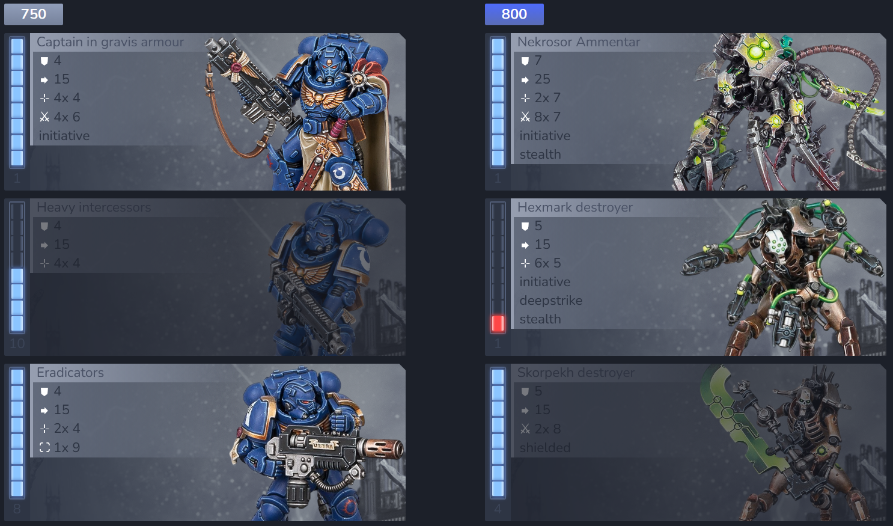

### A custom digital, interactive ruleset for the Warhammer 40.000 tabletop board game.

## Game example

Run "md_create_documents.py" with Python 3.11 or higher to generate HTML documents, then open "index.html".
(all other data under "resources" must be present to work properly)

All images ©Games Workshop.

