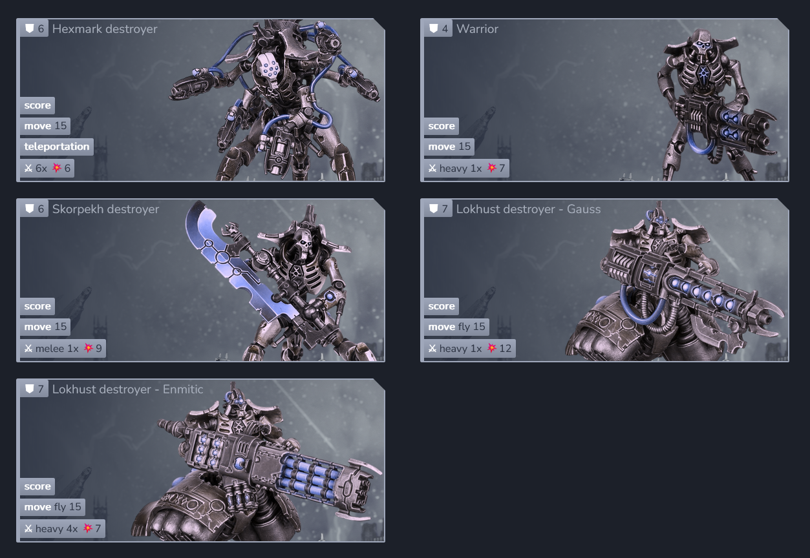

### A custom interactive, lore-accurate ruleset for certain parts of the Warhammer 40.000 and Horus Heresy tabletop board games.

Run "md_create_documents.py" to generate HTML documents, then open "index.html".

## Army list example

## Faction rules

## Core rules excerpt

