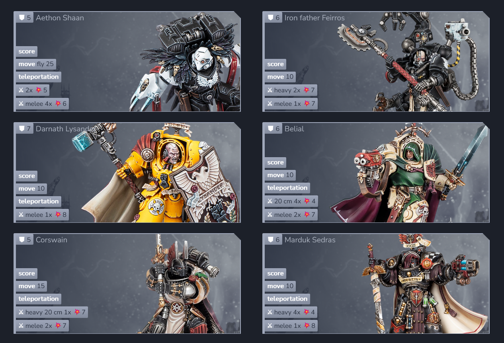

### A custom interactive, lore-accurate ruleset for certain parts of the Warhammer 40.000 and Horus Heresy tabletop board games.

Run "md_create_documents.py" with Python 3.11 or higher to generate HTML documents, then open "index.html".
Alternatively, there is a semi-regularly updated checkpoint version of "index.html" under "resources".
It needs to be moved outside of "resources", and all other data under "resources" must be present to work properly.

## Unit data examples

## Army list example

## Core rules excerpt

